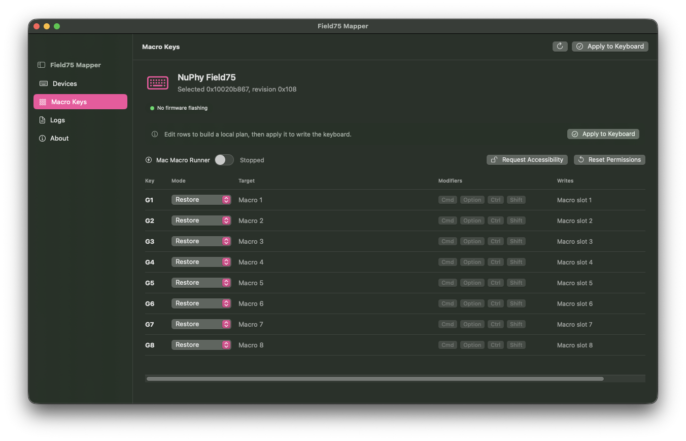

# Field75 Mapper

Field75 Mapper is a small macOS utility for remapping the NuPhy Field75 G macro keys without using the Windows-only Field Console app.

It uses the custom HID protocol recovered from Field Console captures. It does **not** flash firmware, enter the bootloader, or send arbitrary HID reports.



## Status

This is early hardware-specific tooling. G1 has been proven with F13 and F14 on a real Field75, and the write path uses the same capture sequence that made that change take effect. G2-G8 use the live assignment indices recovered from the same protocol work.

Keyboard outputs and supported hardware media/system actions are persistent on the keyboard. Hardware actions use either the recovered Field Console consumer-control assignment format (`0x30` plus a little-endian HID Consumer usage) or a macOS-compatible keyboard shortcut where macOS ignores the raw consumer usage.

Mac Macros are local automation hooks. The keyboard is mapped to a carrier key such as F13-F20, and Field75 Mapper intercepts that carrier while the app is running to open an app, run a named Shortcut, or open a URL.


## Requirements

- macOS 14 or newer
- Xcode command line tools
- A NuPhy Field75 connected over USB

## Build

```sh
swift build
```

## Run the App

```sh
./script/build_and_run.sh
```

The script stages `dist/Field75Mapper.app`, installs it to `/Applications/Field75Mapper.app`, signs it, and launches the installed app as a normal foreground macOS app.

For rebuilds that preserve Input Monitoring and Accessibility permissions, use a stable signing identity:

```sh
FIELD75_CODESIGN_IDENTITY="Field75Mapper Local" ./script/build_and_run.sh --verify
```

If the CLI can see the keyboard but the app cannot, grant the built app Input Monitoring permission:

1. Open System Settings.
2. Go to Privacy & Security > Input Monitoring.
3. Add `/Applications/Field75Mapper.app`.
4. Quit and reopen Field75 Mapper.

Mac Macro mode also needs Accessibility permission. See `Docs/PERMISSIONS.md` for the rebuild-safe permission workflow.

## Applying Changes

Changing a row edits the local plan and saves it in the app. It does not write
the keyboard immediately.

Use **Apply to Keyboard** in the toolbar or Macro Keys page to write the current
plan to the Field75. The app shows a pending-write callout when local edits have
not been applied to the device yet.

## CLI

List matching Field75 HID devices:

```sh
swift run field75ctl list
```

Show supported assignment targets:

```sh
swift run field75ctl targets
```

Dry-run a remap plan:

```sh
swift run field75ctl plan --registry-id 0xYOUR_CONTROL_INTERFACE --set "G1=Next Track"
```

The CLI applies all G-key positions in the generated plan. Any G key not named with `--set` is restored to its default macro slot so stale or placeholder readback bytes are not propagated into G-key positions.

Apply a remap with explicit confirmation:

```sh
swift run field75ctl apply --registry-id 0xYOUR_CONTROL_INTERFACE --set "G1=Next Track" --confirm FIELD75_WRITE_BLOCK38
```

Use the registry ID printed by `list`.

## Safety

- No firmware flashing.
- No bootloader commands.
- No arbitrary report sender.
- Writes are limited to the proven Field Console capture sequence for block `0x38` assignments.
- Readback can be stale after a write, so the app stores the intended G-key state locally and applies all G-key choices together.
- Mac Macros require Accessibility permission because they use a local keyboard event tap.

Reset stale permission grants after bundle/signing changes:

```sh
./script/build_and_run.sh reset-permissions
```

Then re-add `/Applications/Field75Mapper.app` in System Settings > Privacy &
Security for Input Monitoring and, if using Mac Macros, Accessibility.

## Useful Targets

- Hardware actions such as Next Track, Play/Pause, Volume Up, Mute, Browser Back, and Browser Refresh.
- F13-F24 for global shortcuts, BetterTouchTool, Raycast, Keyboard Maestro, Shortcuts, or app-specific hotkeys.
- Common keys and modifier combinations.
- Mac Macros for running a named Shortcut, opening an app such as Mail or Calculator, or opening a URL while Field75 Mapper is running.
- Restore Default for the original Macro Slot 1-8 references. This does not edit the onboard macro script; it only points the key back at the slot.

### macOS vs Windows Hardware Actions

macOS handles media and volume consumer-control usages, but it does not reliably
handle the raw Field Console launch/browser usages for actions such as Open Mail,
Calculator, Computer, Browser Home, or Favorites.

Field75 Mapper therefore has platform-specific hardware actions:

- **macOS**: media/volume use consumer usages; browser back/forward/search/refresh/stop use keyboard shortcut assignments like `Cmd+[` and `Cmd+R`.
- **Windows**: writes the raw Field Console consumer usages, including launch/browser actions that Windows understands.

Use Mac Macro mode on macOS for opening apps or running Shortcuts.

## Development

Run tests:

```sh
swift test
```

If this repo is stored under a file-provider-backed `Documents` folder and codesign reports "resource fork, Finder information, or similar detritus not allowed" for the test bundle, use a scratch path outside Documents:

```sh
swift test --scratch-path /tmp/Field75MapperBuild
```

Launch and verify the app process:

```sh
./script/build_and_run.sh --verify
```

The product and technical specs live in `specs/field75-mapper/`.

## Reverse Engineering Reference

Protocol notes for contributors live in `Docs/REVERSE_ENGINEERING.md`.

That document summarizes the observed USB transport, assignment table, G-key
offsets, hardware action encodings, static leads that are not implemented yet,
and the capture workflow needed for future lighting, profile, macro, knob, or
wireless work.
